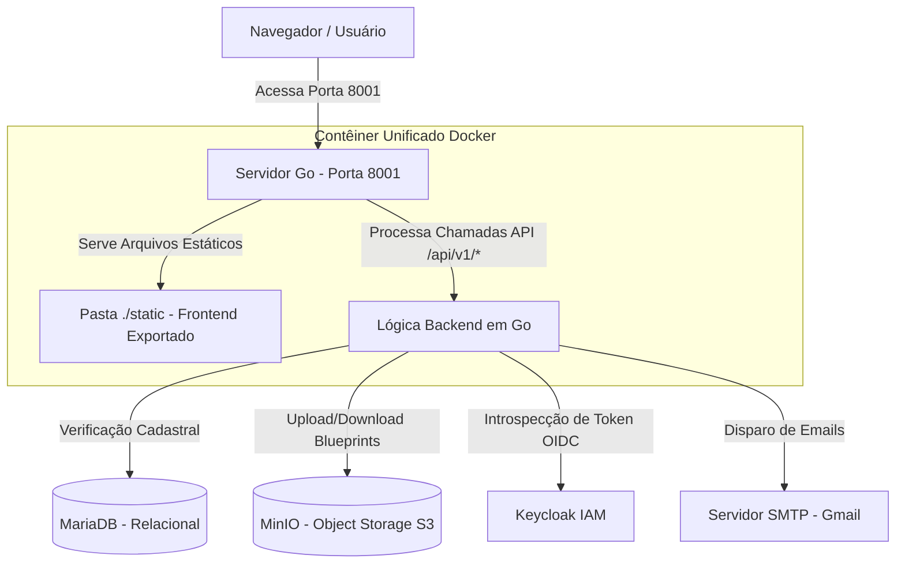

# 🏥 Open Health — Conjunto de Aplicações Medicinais para Modelagem de Sistemas

Este repositório contém o projeto de conclusão de curso (TCC) **Open Health**. O sistema foi concebido como uma plataforma de modelagem e prototipagem rápida de software de gestão clínica médica. Por meio de um Wizard interativo passo a passo, o gestor de uma clínica pode configurar a identidade visual de sua marca, escolher módulos funcionais desejados (como prontuários, faturamento e agendas) e definir dimensionamento técnico. O resultado é um **System Blueprint (JSON)** criptografado com as especificações da arquitetura da clínica e uma simulação navegável em tempo real do sistema gerado.

---

## 🌎 Visão Geral da Arquitetura Integrada

O projeto foi projetado com uma arquitetura desacoplada e conteinerizada, garantindo que o front-end e o back-end possam se comunicar de forma rápida e segura. A imagem abaixo exemplifica o fluxo de requisições e a orquestração do ecossistema:



### Componentes Integrados do Ecossistema

1.  **Interface SPA (Front-end)**:
    *   Construída com **Next.js 16**, **React 19** e **Material UI 7**.
    *   Durante a compilação, o Next.js realiza uma exportação estática pura (`output: 'export'`). Todos os componentes de modelagem do Wizard e do Simulador são compilados para HTML, CSS e JavaScript estáticos, sem a necessidade de um servidor Node.js em execução.
2.  **Servidor de Alta Performance (Back-end)**:
    *   Desenvolvido em **Go (1.25)** utilizando o framework **Gin Gonic**.
    *   **Duplo Papel**: O backend serve como a API RESTful de controle de projetos e autenticação e, simultaneamente, atua como um servidor de arquivos de alto desempenho que serve a pasta estática gerada pelo Next.js.
3.  **Provedor de Identidade e Acesso (Keycloak IAM)**:
    *   Centraliza o cadastro de usuários administradores, políticas de complexidade de senha e segurança de sessões.
    *   O backend delega toda a autenticação para o Keycloak através de protocolos OAuth2/OIDC, utilizando introspecção de token (RFC 7662) para validação ativa de acessos.
4.  **Armazenamento de Objetos (MinIO - S3)**:
    *   Utilizado para guardar os Blueprints de modelagem das clínicas de forma descentralizada em buckets isolados por inquilino (*multi-tenancy* lógico).
5.  **Base de Dados Relacional (MariaDB)**:
    *   Armazena os registros estruturados das clínicas cadastradas, metadados de localização, telefone, especialidade e o status de verificação da conta local.

---

## 🔒 Segurança e Privacidade: Zero-Knowledge Storage

Um diferencial acadêmico relevante do Open Health é a abordagem de segurança voltada para a privacidade de dados corporativos sensíveis:

*   **Criptografia Simétrica Baseada em Fatores**: O backend implementa um mecanismo de **Object Vault** na persistência de blueprints. Antes de subir qualquer arquivo para o MinIO, o sistema cifra o payload usando **AES-256-GCM**.
*   **Derivação de Chaves (PBKDF2)**: A chave de criptografia de 256 bits de cada clínica é única, gerada sob demanda a partir da combinação de segredos ambientais do backend (`OBJ_KEY`), CNPJ e E-mail da clínica. Isso significa que nem mesmo um administrador com acesso físico total ao bucket S3 consegue decifrar ou visualizar as configurações das clínicas sem os dados relacionais e a chave mestra de ambiente.

---

## 📁 Estrutura de Diretórios e Documentações Específicas

Para facilitar a navegação do comitê acadêmico e de desenvolvedores, o repositório está subdividido em pastas isoladas com documentações detalhadas de suas respectivas lógicas internas:

```
webproject_para_modelagem_de_sistema/
├── front-end/      # Interface SPA em React/Next.js (Modelagem e Simulador Clínico)
│   └── README.md   # Documentação de Estados, Roteamento SPA e Telas de Simulação
├── back-end/       # API Go baseada em Clean Architecture (Ports & Adapters)
│   └── README.md   # Documentação de Criptografia Vault, Keycloak e Banco de Dados
├── Dockerfile      # Configuração de build multiprocessos Docker
├── docker-compose.yml # Auxiliar para inicialização rápida de banco e armazenamento
└── README.md       # Esta documentação global do sistema
```

---

## 🚀 Como Executar o Projeto de Forma Integrada (Docker)

A maneira mais rápida e profissional de executar todo o ambiente integrado (incluindo o processo de build do Next.js e compilação do binário Go em uma imagem otimizada de produção de tamanho mínimo) é utilizando o **Dockerfile** presente na raiz do projeto.

### 1. Criando Arquivo de Configuração Global
O contêiner do backend precisará de variáveis de ambiente. Certifique-se de configurar o arquivo `.env` na pasta `back-end` conforme as instruções descritas no [README do Back-end](back-end/README.md).

### 2. Construindo a Imagem Docker
Na raiz do repositório, execute o build da imagem unificada:
```bash
docker build -t openhealth-app .
```
Este comando executará um build em multi-estágios (Multi-stage build):
1.  **Estágio 1**: Instala dependências do Node e compila o front-end gerando a pasta de arquivos estáticos.
2.  **Estágio 2**: Compila o binário estático Go otimizado para arquitetura Linux de produção.
3.  **Estágio 3**: Monta uma imagem final mínima usando Alpine Linux, contendo apenas o executável compilado do Go e os arquivos HTML/JS estáticos do front-end, resultando em uma imagem leve e altamente segura.

### 3. Rodando o Contêiner
Suba a aplicação informando o caminho do seu arquivo `.env` local:
```bash
docker run -d -p 8001:8001 --env-file back-end/.env --name openhealth openhealth-app
```
Acesse [http://localhost:8001](http://localhost:8001) para navegar no Wizard e no simulador da aplicação. O endpoint de verificação de saúde da aplicação estará ativo em `http://localhost:8001/api/v1/health`.
