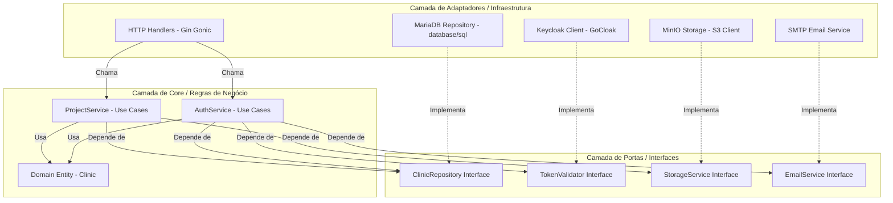

# 🛡️ Open Health Backend — API & Cryptographic Object Vault Service

Este repositório contém o back-end da plataforma **Open Health**, projetado para atuar como o motor de regras de negócio, persistência estruturada e segurança criptográfica de blueprints para modelagem de sistemas médicos.

O sistema foi concebido utilizando os princípios da **Arquitetura Hexagonal (Ports & Adapters)** em Go (v1.25), garantindo isolamento da lógica de domínio frente a detalhes de infraestrutura (como banco de dados, provedores de armazenamento em nuvem e servidores de identidade).

---

## 🏛️ Arquitetura de Software

A estrutura interna segue estritamente a divisão em camadas para isolar o núcleo da aplicação de acoplamentos tecnológicos externos:



### 1. Camada Core (Core Layer)
*   **`domain/`**: Define a entidade principal do sistema, `Clinic`, que contém os metadados do inquilino (tenant) como CNPJ, e-mail, nome da clínica, localização, especialidade e referências de armazenamento de objetos.
*   **`ports/`**: Define os contratos (interfaces) que determinam como o núcleo interage com o mundo externo. Isso assegura que qualquer adaptador possa ser substituído sem impactar as regras de negócio.
*   **`services/`**: Contém a implementação dos casos de uso (Use Cases):
    *   `AuthService`: Orquestra o fluxo de registro no Keycloak, criação local na base MariaDB, geração de códigos de verificação, autenticação direta via Keycloak, renovação de sessões e introspecção de tokens.
    *   `ProjectService`: Gerencia a criação, leitura e exclusão dos Blueprints de sistemas médicos modelados, intermediando a criptografia do payload.

### 2. Camada de Adaptadores (Adapters Layer)
*   **`handlers/http/`**: Ponto de entrada das requisições REST da aplicação utilizando o framework **Gin Gonic**. Inclui rotas públicas de autenticação (`/auth/register`, `/auth/login`, `/auth/verify`) e rotas privadas protegidas pelo middleware de autenticação (`/projects`).
*   **`repositories/mariadb/`**: Persiste e lê os dados da clínica no MariaDB usando instruções SQL cruas otimizadas com cláusulas `ON DUPLICATE KEY UPDATE` para operações atômicas de escrita.
*   **`repositories/minio/`**: Persiste os blueprints de modelagem em formato JSON compactado no servidor compatível com S3 (MinIO).
*   **`services/email/`**: Implementa o despachante SMTP padrão para disparar e-mails de verificação cadastral com templates em HTML customizados e estilizados.

---

## 🔒 Mecanismos de Segurança e Lógicas Chave

### 1. Cryptographic Object Vault (`pkg/vault`)
Para mitigar os riscos de vazamento de dados de configuração e arquitetura sensível das clínicas armazenadas em nuvem, o sistema implementa uma camada de criptografia simétrica com política de **Zero-Knowledge** (conhecimento zero) no armazenamento de blueprints S3.

#### Processo de Derivação de Chave (KDF)
Antes de persistir qualquer arquivo de projeto no MinIO, o backend gera uma chave criptográfica AES de 256 bits altamente entrópica, derivada de três fatores independentes usando o algoritmo **PBKDF2 (Password-Based Key Derivation Function 2)**:
1.  **`nodeRef`**: O e-mail cadastrado da clínica.
2.  **`branchId`**: O CNPJ associado.
3.  **`seedToken`**: Segredo criptográfico global injetado via variável de ambiente (`OBJ_KEY`).

A fórmula matemática de composição da chave é:

$$\text{Chave} = \text{PBKDF2}(\text{CNPJ} \parallel \text{Email} \parallel \text{Segredo}, \text{Salt}, 100.000, 32, \text{SHA-256})$$

Onde o **Salt** é derivado gerando um hash SHA-256 contendo o CNPJ e parte do segredo global para mitigar ataques de tabela arco-íris (rainbow tables).

#### Algoritmo de Criptografia: AES-256-GCM
O blueprint estruturado é convertido para binário (JSON) e encriptado usando **AES-256 em modo GCM (Galois/Counter Mode)**. Esse modo garante não apenas a confidencialidade do arquivo, mas também a integridade autêntica dos dados (se houver alteração de um bit sequer no S3 por agentes maliciosos, a decifragem falhará com erro de autenticidade). 
O arquivo resultante é serializado sob a estrutura `SealedObject`:
```json
{
  "n": "[NONCE_BASE64]",
  "p": "[PAYLOAD_CRIPTOGRAFADO_BASE64]",
  "t": "",
  "v": 1
}
```

### 2. Autenticação e IAM via Keycloak
O gerenciamento de usuários, políticas de credenciais e geração de tokens é delegado ao **Keycloak** (servidor IAM de nível empresarial). O backend atua como um facilitador e validador:
*   **Registro**: Cria um registro de usuário correspondente no Keycloak associando atributos específicos (`tipo_usuario: clinica`) para controle de acesso granular baseado em atributos (ABAC).
*   **Introspecção (RFC 7662)**: Em vez de decodificar localmente o JWT assinado (o que não garante o estado de revogação em tempo real), o `AuthMiddleware` realiza chamadas HTTP de introspecção diretamente no endpoint do Keycloak. Isso valida se a sessão ainda está ativa, se o token foi revogado no console e se a conta do administrador não foi bloqueada.
*   **Mapeamento Local (Tenant Isolation)**: Uma vez validada a sessão no Keycloak, o backend busca a correspondência local pelo campo `sub` (Keycloak ID) para injetar o `tenant_id` e o `clinic_name` no contexto da requisição Gin, garantindo o isolamento lógico total das consultas.

---

## 📁 Organização de Pastas

```
back-end/
├── cmd/
│   └── api/
│       └── main.go         # Inicialização de dependências, banco e roteamento HTTP
├── internal/
│   ├── adapters/           # Implementação das portas definidas no core (infraestrutura)
│   │   ├── handlers/
│   │   │   └── http/       # Controladores REST Gin e Middleware de segurança
│   │   ├── repositories/
│   │   │   ├── mariadb/    # Conexão e comandos SQL para MariaDB
│   │   │   └── minio/      # Gerenciamento de Upload/Download no MinIO (S3)
│   │   └── services/
│   │       └── email/      # Disparador de email SMTP HTML
│   └── core/               # Lógica pura de negócio (independente de libs externas)
│       ├── domain/         # Definição de estruturas e entidades
│       ├── ports/          # Interfaces (contratos)
│       └── services/       # Implementação dos Casos de Uso
├── pkg/                    # Utilitários globais reutilizáveis
│   ├── config/             # Parser e carregamento de configurações (.env)
│   ├── database/           # Pool de conexões do driver MariaDB
│   ├── logger/             # Estrutura de logging padronizada
│   ├── utils/              # Hash de senhas (legacy) e helpers JWT
│   └── vault/              # Algoritmo de criptografia do Object Vault (AES-GCM/PBKDF2)
├── docker-compose.yml      # Orquestração do MinIO e utilitário de criação de Buckets
├── go.mod                  # Manifesto de dependências Go
└── go.sum                  # Verificação de hashes de dependência Go
```

---

## 🚀 Como Configurar e Executar

### Pré-requisitos
*   **Go** instalado (versão 1.21+)
*   **Docker & Docker Compose** (para subir o MinIO local)
*   **MariaDB/MySQL** ativo
*   Instância ativa do **Keycloak**

### 1. Configurando Variáveis de Ambiente
Crie um arquivo `.env` na raiz da pasta `back-end` usando o `.env.example` como modelo:
```bash
cp .env.example .env
```
Preencha as variáveis de ambiente necessárias:
*   `PORT`: Porta de escuta da API (ex: `8080`).
*   `DB_HOST`, `DB_PORT`, `DB_USER`, `DB_PASSWORD`, `DB_NAME`: Parâmetros de acesso ao MariaDB.
*   `JWT_SECRET`: Chave secreta de contingência.
*   `SMTP_HOST`, `SMTP_PORT`, `SMTP_USER`, `SMTP_PASSWORD`: Credenciais do servidor de email para verificação de contas.
*   `MINIO_ENDPOINT`, `MINIO_ACCESS_KEY`, `MINIO_SECRET_KEY`, `MINIO_BUCKET_NAME`: Configurações de conexão para o S3.
*   `OBJ_KEY`: Token segredo para derivação da chave criptográfica no Vault (mantenha seguro e confidencial!).
*   `KEYCLOAK_URL`, `KEYCLOAK_REALM`, `KEYCLOAK_CLIENT_ID`, `KEYCLOAK_CLIENT_SECRET`: Dados de integração OIDC com o Keycloak.

### 2. Iniciando Infraestrutura Auxiliar (MinIO)
Suba o servidor MinIO e a criação automática de bucket usando Docker Compose:
```bash
docker compose up -d
```
Isso iniciará o painel administrativo do MinIO em [http://localhost:9001](http://localhost:9001) e a API na porta `9000`.

### 3. Rodando o Servidor
Com a base de dados configurada e o Keycloak ativo, execute:
```bash
go run cmd/api/main.go
```
O servidor começará a escutar na porta definida e validará a comunicação com o banco e Keycloak imediatamente durante a inicialização.
