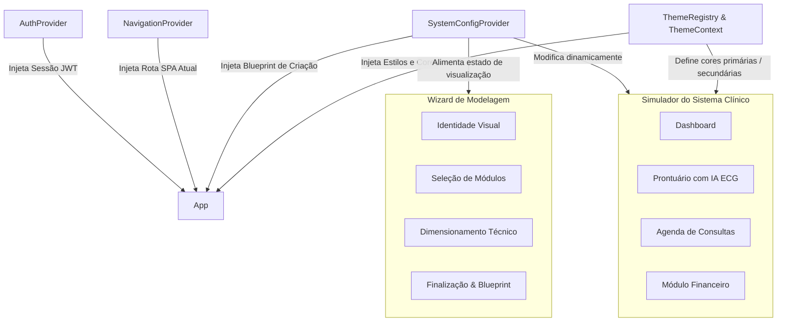

# 💻 Open Health Frontend — Client-Side Modeling Wizard & Interactive Simulator

Este repositório contém a interface web da plataforma **Open Health**. Trata-se de uma aplicação SPA (Single-Page Application) de alta fidelidade construída com **React 19**, **Next.js 16** (configurado para exportação estática) e **Material UI (MUI) 7** utilizando **TypeScript**.

A aplicação desempenha um duplo papel na arquitetura acadêmica do TCC:
1.  **Wizard de Modelagem**: Um formulário interativo de 4 etapas que guia o gestor da clínica na definição de sua identidade visual, recursos funcionais desejados (módulos) e infraestrutura técnica de implantação.
2.  **Simulador de Sistema Médico**: Um protótipo navegável em tempo real que reflete instantaneamente as customizações feitas no wizard, permitindo visualizar como o sistema final (Doctor, Assistant, Management) se comportaria.

---

## 🏛️ Fluxo de Estados e Contextos (State Management)

Para gerenciar o estado global sem a necessidade de bibliotecas pesadas de terceiros (como Redux ou Zustand), a aplicação faz uso extensivo da **React Context API** combinada com hooks de redução de estado (`useReducer`):



### Detalhamento dos Provedores de Contexto

1.  **`AuthContext.tsx`**:
    *   Gerencia o ciclo de vida da autenticação do usuário.
    *   Armazena e valida tokens JWT no `localStorage`.
    *   **Mecanismo de Auto-Refresh**: Implementa um efeito periódico (`setInterval`) que revalida o token de acesso de forma transparente junto à API a cada 4 minutos usando o *refresh token*, mantendo a sessão segura e ativa sem interrupções para o usuário.
2.  **`NavigationContext.tsx`**:
    *   Provê um roteador customizado baseado em estados no cliente.
    *   Evita incompatibilidades de rotas estáticas típicas de exportações Next.js (`output: 'export'`), chaveando dinamicamente entre telas (`LANDING`, `LOGIN`, `REGISTER`, `VERIFY`, `SYSTEM_CREATION`) de forma instantânea.
3.  **`SystemConfigContext.tsx`**:
    *   Gerencia os dados e a lógica do Wizard usando uma máquina de estados baseada em `useReducer`.
    *   **Lógica de Deep Merge**: Atualiza de forma segura dados aninhados da configuração (como sub-recursos do prontuário médico) sem perder propriedades adjacentes por meio de uma função recursiva de mesclagem profunda.
    *   **Sanitização de Blueprint**: Antes de despachar o blueprint para salvamento na API externa, o contexto purga os dados brutos em Base64 do logotipo customizado, evitando sobrecarga na transmissão de rede e no armazenamento do objeto S3.
4.  **`ThemeContext.tsx`**:
    *   Integra o Material UI Theme Engine.
    *   Garante suporte a temas claros e escuros (Dark Mode) baseados em presets ou na paleta personalizada selecionada pelo usuário no primeiro passo do Wizard.

---

## 🎨 O Simulador do Sistema Clínico (Interactive Preview)

O recurso mais inovador do frontend é a tela de **System Preview** (`app/guided/preview/`). Ele renderiza uma simulação fiel do painel operacional da clínica, adaptando-se em tempo real às opções de configuração selecionadas no Wizard:

*   **Customização Estética Dinâmica**: A barra lateral de navegação e os componentes herdam imediatamente o esquema de cores primárias/secundárias escolhido no passo de Identidade.
*   **Controle de Recursos por Feature Flags**:
    *   Se o usuário desativar o módulo de faturamento assistencial, a tela e os botões de controle financeiro desaparecem do simulador.
    *   O prontuário eletrônico simulado (`PreviewPatientRecord.tsx`) exibe ou oculta abas como Alergias, Upload de Arquivos e o painel de **Análise de ECG assistida por IA** de acordo com as caixas de seleção marcadas no segundo passo do Wizard.
*   **Dados Simulados Interativos**: Telas como Agenda (`PreviewSchedule.tsx`) e Atendimento (`PreviewStaffAttendance.tsx`) respondem a ações do usuário (adicionar eventos, simular check-in/check-out de pacientes), provendo uma experiência rica e tátil ao usuário final.

---

## 📁 Estrutura de Diretórios

```
front-end/
├── app/
│   ├── components/         # Componentes estáticos da interface (Navbar, Footer, etc.)
│   ├── contexts/           # Centralização de estados globais (Auth, Navigation, Config, Theme)
│   ├── guided/             # Módulo do Wizard de Modelagem
│   │   ├── steps/          # Telas de entrada de dados para cada etapa do Wizard
│   │   │   ├── StepIdentity.tsx       # Etapa 1: Marca, Cores e Nome da Clínica
│   │   │   ├── StepModules.tsx        # Etapa 2: Módulos funcionais (Médico, Assistente, Admin)
│   │   │   ├── StepTechnical.tsx      # Etapa 3: Sizing, SLA, Cloud e Custos Estimados
│   │   │   └── StepFinalization.tsx   # Etapa 4: Exibição do Blueprint JSON finalizado
│   │   ├── preview/        # Telas e componentes do Simulador Médico
│   │   │   ├── screens/    # Telas internas (Dashboard, Agenda, Prontuário, Financeiro, etc.)
│   │   │   └── SystemPreview.tsx      # Orquestrador da simulação de alta fidelidade
│   │   ├── GuidedWizard.tsx           # Gerenciador de passos e validação do formulário
│   │   └── constants.ts               # Constantes de passo e limites de dimensionamento
│   ├── pages/              # Páginas SPA principais (Landing, Login, Register, Verify, etc.)
│   ├── services/           # Comunicação REST com o backend (API Client fetch)
│   ├── types/              # Definições de interfaces TypeScript para o Blueprint
│   ├── globals.css         # Reset de CSS e importações globais de tipografia
│   ├── layout.tsx          # Layout base do Next.js
│   ├── page.tsx            # Ponto de entrada do SPA que lê o NavigationContext
│   ├── theme.ts            # Configurações do tema padrão do Material UI (MUI)
│   └── ThemeRegistry.tsx   # Registrador de cache de estilos para renderização segura no cliente
├── public/                 # Imagens estáticas e recursos públicos do projeto
├── next.config.ts          # Arquivo de configuração do Next.js (com output: 'export')
├── tsconfig.json           # Configurações do compilador TypeScript
└── package.json            # Manifesto de dependências do Node.js
```

---

## 🚀 Como Executar

### Pré-requisitos
*   **Node.js** instalado (versão 18+)
*   Gerenciador de pacotes **npm**

### 1. Instalação das Dependências
Entre na pasta do front-end e execute o comando abaixo para instalar as bibliotecas de interface, mapas e utilitários:
```bash
npm install
```

### 2. Executando em Modo de Desenvolvimento
Para iniciar a aplicação com recarregamento rápido (Hot Reload):
```bash
npm run dev
```
Abra [http://localhost:3000](http://localhost:3000) no seu navegador. O front-end tentará se comunicar com a API local em `http://localhost:8080/api/v1` em ambiente de desenvolvimento.

### 3. Compilando para Produção (Build Estático)
Para compilar a aplicação e gerar o build estático pronto para ser servido pelo binário em Go:
```bash
npm run build
```
Os arquivos gerados serão salvos na pasta `front-end/out/`. No Dockerfile multiprocessos do projeto, o conteúdo dessa pasta é automaticamente copiado para a pasta `/static` do binário do servidor backend.
